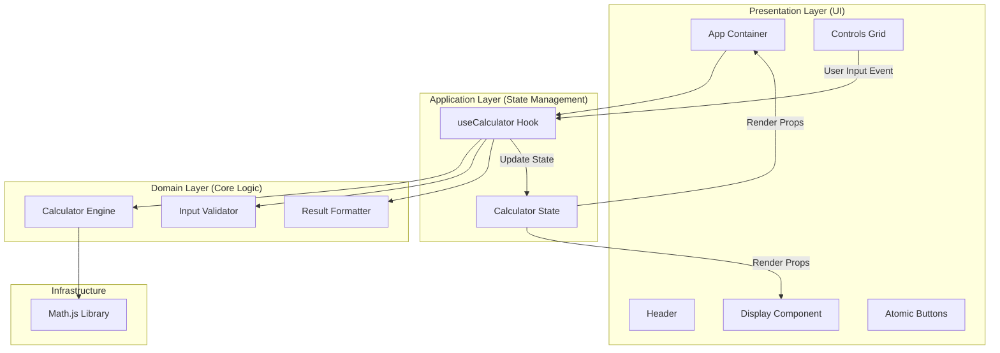

# Scientific Calculator Web App 🧮

[](https://github.com/serithemage/calculator-demo/actions/workflows/deploy.yml)


> **"단순한 기능 구현을 넘어, 엔지니어링 원칙(SOLID, TDD)을 준수하여 설계된 고품질 웹 애플리케이션입니다."**

이 프로젝트는 현대적인 웹 개발 기술 스택과 견고한 소프트웨어 아키텍처를 기반으로 설계된 **공학용 전자계산기**입니다. 단순한 계산 기능을 넘어, 유지보수성과 확장성을 고려한 **Clean Code**와 **Test-Driven Development (TDD)** 방법론을 적용한 결과물입니다.

🔗 **Live Demo**: [https://serithemage.github.io/calculator-demo/](https://serithemage.github.io/calculator-demo/)

---

## ✨ Key Features (핵심 기능)

- **Advanced Mathematics**: 사칙연산은 물론 삼각함수(sin, cos, tan), 로그(ln, log), 지수 연산 등 공학용 계산 지원
- **Robust Logic**: `math.js` 기반의 정밀한 수식 처리 및 괄호/우선순위 연산 완벽 지원
- **User-Centric UX**:
  - 모바일 퍼스트(Mobile-First) 반응형 디자인
  - 다크 모드(Dark Mode) 지원
  - 직관적인 히스토리 및 실시간 수식 프리뷰
- **High Performance**: Vite 기반의 초고속 로딩 및 최적화된 렌더링

---

## 🏗️ Architecture & Engineering (아키텍처 및 공학적 설계)

이 프로젝트의 핵심 가치는 **"지속 가능한 소프트웨어"**입니다. UI와 비즈니스 로직을 철저히 분리하여, 로직의 테스트 용이성과 UI의 변경 유연성을 모두 확보했습니다.

### 1. SOLID Principles Applied
- **SRP (단일 책임 원칙)**: 계산 엔진(`Calculator`), 입력 검증(`Validator`), 포맷팅(`Formatter`)의 책임을 명확히 분리
- **DIP (의존성 역전 원칙)**: UI 컴포넌트는 구체적인 로직이 아닌, Custom Hook 인터페이스에 의존

### 2. TDD (Test-Driven Development) Process
모든 코어 로직은 **Red-Green-Refactor** 사이클을 통해 개발되었으며, **100%의 단위 테스트 커버리지**를 목표로 합니다.
- 🔴 실패하는 테스트 작성 (요구사항 정의)
- 🟢 최소한의 구현 코드로 테스트 통과
- 🔵 리팩토링으로 코드 품질 향상

### 3. System Architecture Diagram



---

## 🛠️ Technology Stack (기술 스택)

- **Frontend Core**: React 18, TypeScript (Strict Mode)
- **Build Tool**: Vite (Super fast HMR)
- **Styling**: Tailwind CSS (Utility-first framework)
- **Math Engine**: Math.js
- **Testing**: Vitest (Unit Testing)
- **CI/CD**: GitHub Actions, GitHub Pages

---

## 🚀 Getting Started

프로젝트를 로컬 환경에서 실행하는 방법입니다.

### Prerequisites
- Node.js 18.0.0 or higher
- npm or yarn

### Installation

```bash
# 1. Clone the repository
git clone https://github.com/serithemage/calculator-demo.git

# 2. Navigate to project directory
cd calculator-demo

# 3. Install dependencies
npm install

# 4. Start development server
npm run dev
```

### Running Tests

코어 로직의 무결성을 검증하기 위해 다음 명령어로 테스트를 실행할 수 있습니다.

```bash
# Run Unit Tests
npm test
```

---

## 👨‍💻 Project Structure

```
src/
├── components/     # Reusable UI Components (Atomic Design)
│   ├── Buttons/    # Number, Operator, Function Buttons
│   └── Calculator/ # Display, Controls, Header
├── hooks/          # Custom Hooks (useCalculator)
├── utils/          # Core Business Logic (Pure Functions)
│   ├── calculator.ts
│   ├── formatter.ts
│   └── validator.ts
├── styles/         # Global Styles & Tailwind Config
└── test/           # Test Setup & Fixtures
```

---

## 📝 License

This project is open sourced under the MIT License.
